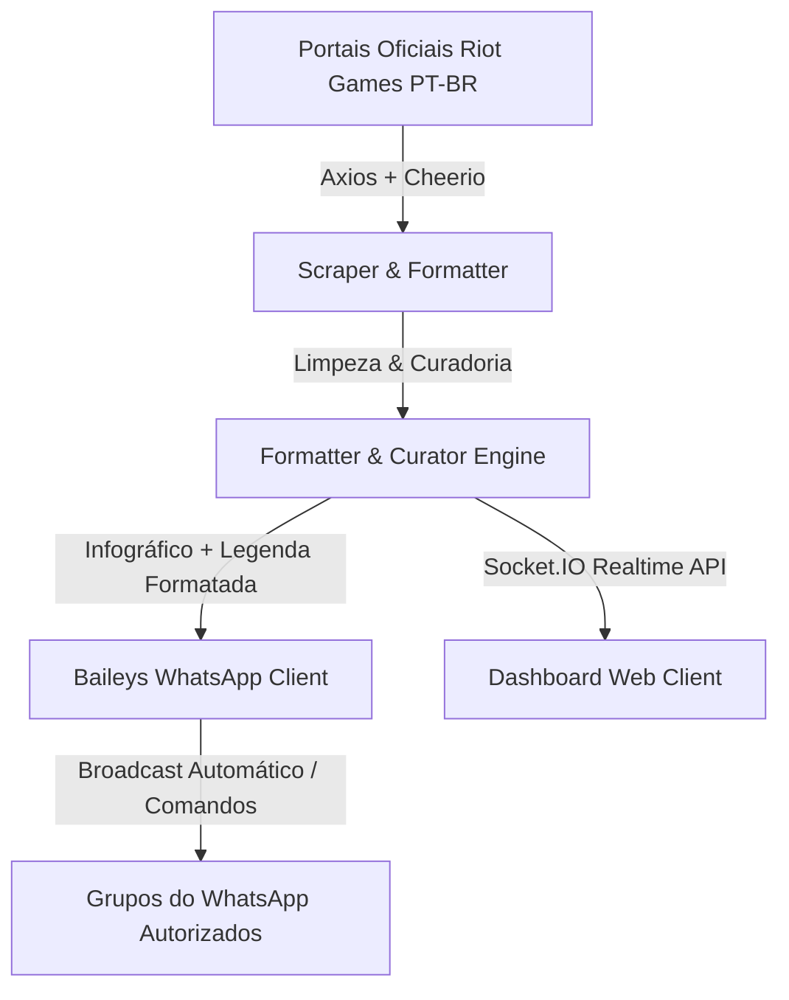

<div align="center">

# ⚔️ Bot de WhatsApp - Patch Notes LoL, TFT & ARAM Desordem 🎲

  <p align="center">
    <strong>Bot inteligente para WhatsApp com envio automático de notas de atualização oficiais do League of Legends e Teamfight Tactics em PT-BR, acompanhadas de Infográficos de Destaques e Links Oficiais.</strong>
  </p>

  <p align="center">
    <a href="https://nodejs.org"></a>
    <a href="https://github.com/whiskeysockets/baileys"></a>
    <a href="https://expressjs.com"></a>
    <a href="https://leagueoflegends.com"></a>
    <a href="LICENSE"></a>
  </p>
</div>

---

## 📌 Sobre o Projeto

Este bot foi desenvolvido para comunidade e grupos de **League of Legends** e **Teamfight Tactics**. Ele monitora os portais oficiais da **Riot Games Brasil**, raspa os artigos completos de atualização, realiza a curadoria técnica dos dados (removendo textos introdutórios e piadas) e formata a mensagem para leitura clara no WhatsApp.

Além do texto legível com emojis e separadores organizados, o bot anexa a **imagem infográfica oficial de Destaques da Atualização** (League of Legends e TFT) e adiciona o **link oficial do site no rodapé**.

---

## ✨ Principais Recursos

- 🖼️ **Infográficos Oficiais da Riot**: Envia a imagem em alta resolução de Destaques da Atualização (`1920x1080` no LoL e `3067x1726` no TFT) como anexo de imagem no WhatsApp com a legenda formatada.
- 🎯 **Curadoria & Leitura Completa das Habilidades**: Extrai o nome exato da habilidade (ex: `🎯 E – Aperto Mortal`) e a transição exata das estatísticas (`Dano: 60/75/90/105/120 (+40% AP) ⇒ 60/80/100/120/140 (+45% AP)`).
- 💥 **Modo Exclusivo ARAM: Desordem (`!ad`)**: Raspa e exibe apenas os aprimoramentos, mecânicas e correções de bugs exclusivas do modo ARAM Desordem.
- 🎲 **Suporte Completo ao TFT (`!tft`)**: Raspa unidades divididas por tiers (Tier 1 ao 5), características, aprimoramentos e bugs do Teamfight Tactics.
- 📅 **Calendário PT-BR com Dia da Semana (`!agenda`)**: Exibe as datas de lançamento das atualizações formatadas no padrão brasileiro com o dia da semana correspondente.
- 🌐 **Dashboard Web Integrado (`http://localhost:3000`)**: Painel de controle em tempo real com leitura de QR Code, sincronização de grupos e prévia visual do balão do WhatsApp.
- 🛡️ **Resistente a Falhas & Mensagens Temporárias**: Suporte completo a grupos com Mensagens Temporárias (Ephemeral) ativadas e alias amigáveis para digitação.

---

## 🕹️ Lista de Comandos

Todos os comandos devem ser enviados nos grupos autorizados ou no privado do bot:

| Comando | Descrição | Anexos / Formato |
| :--- | :--- | :--- |
| **`!iniciar`** (ou `!inciar`) | Autoriza o grupo atual a receber notificações automáticas. | 🤖 Mensagem de Boas-Vindas |
| **`!patch`** / **`!lol`** | Exibe as notas completas de atualização do League of Legends. | 🖼️ Infográfico + 🔗 Link Oficial |
| **`!ad`** / **`!desordem`** | Exibe as mudanças exclusivas do modo **ARAM: DESORDEM**. | 🔗 Link Oficial |
| **`!tft`** | Exibe as notas completas de atualização do Teamfight Tactics. | 🖼️ Infográfico TFT + 🔗 Link Oficial |
| **`!agenda`** / **`!proximo`** | Exibe a data do patch atual e do próximo patch em PT-BR. | 📅 Data + Dia da Semana |
| **`!ajuda`** / **`!help`** | Lista os comandos disponíveis no bot. | 📌 Guia Rápido |

---

## 🏗️ Arquitetura do Sistema



---

## 🚀 Como Executar Localmente

### Pré-requisitos
- **Node.js**: Versão 18.x ou superior.
- **npm**: Versão 9.x ou superior.

### 1. Clonar o Repositório
```bash
git clone https://github.com/acssjr/bot-atualizacoes-whatsapp-lol.git
cd bot-atualizacoes-whatsapp-lol
```

### 2. Instalar Dependências
```bash
npm install
```

### 3. Iniciar o Bot & Dashboard Web
```bash
npm start
```

### 4. Conectar o WhatsApp
1. Abra o navegador e acesse o Dashboard Web: **`http://localhost:3000`**
2. No seu celular, abra o WhatsApp ➔ **Aparelhos Conectados** ➔ **Conectar um Aparelho**.
3. Escaneie o QR Code exibido na tela ou no terminal.

---

## ☁️ Hospedagem 24/7 (Manter Rodando Continuamente)

Para manter o bot funcionando 24 horas por dia sem depender do seu computador ligado, recomendamos uma **VPS (Virtual Private Server)** com o gerenciador de processos **PM2**.

### Passo a Passo no Servidor Linux (Ubuntu/Debian):

```bash
# 1. Instalar Node.js e PM2 no Servidor
sudo apt update && sudo apt upgrade -y
curl -fsSL https://deb.nodesource.com/setup_20.x | sudo bash -
sudo apt install -y nodejs git
sudo npm install -g pm2

# 2. Clonar e Instalar o Bot
git clone https://github.com/acssjr/bot-atualizacoes-whatsapp-lol.git
cd bot-atualizacoes-whatsapp-lol
npm install

# 3. Iniciar em Segundo Plano com PM2
pm2 start src/index.js --name "bot-lol-tft"
pm2 save
pm2 startup
```

Para mais detalhes sobre hospedagem em nuvem (Oracle Cloud Free, Hetzner, DigitalOcean ou Railway), consulte o [Guia de Hospedagem](deployment_guide.md).

---

## 📂 Estrutura de Arquivos

```text
├── public/
│   └── index.html             # Interface gráfica do Dashboard Web com Socket.IO
├── src/
│   ├── commands/
│   │   └── handler.js         # Processador central de comandos (!lol, !tft, !ad, etc.)
│   ├── services/
│   │   ├── cronService.js     # Agendador de verificações automáticas de fundo (30 min)
│   │   ├── riotScraper.js     # Extrator de matérias oficiais da Riot Games
│   │   ├── translator.js      # Adaptador de termos gamer para PT-BR
│   │   └── whatsapp.js        # Cliente Baileys do WhatsApp e gerenciador de grupos
│   ├── utils/
│   │   ├── patchCurator.js    # Curadoria de texto, piadas e caracteres especiais
│   │   └── patchFormatter.js  # Formatador completo de mensagens e infográficos
│   ├── index.js               # Ponto de entrada do sistema
│   └── server.js              # Servidor Web Express + Socket.IO
├── config.json                # Configuração e lista de grupos autorizados
├── state.json                 # Estado e cache das matérias enviadas
├── package.json
└── README.md
```

---

## 📄 Licença

Este projeto está sob a licença **MIT**. Veja o arquivo [LICENSE](LICENSE) para mais detalhes.

---

<div align="center">
  <sub>Desenvolvido com ❤️ para a comunidade de League of Legends & TFT Brasil.</sub>
</div>
